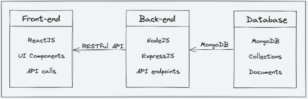

# 🎓 StudyNotion – Ed-Tech Platform

**StudyNotion** is a modern, full-stack Ed-Tech platform that enables users to **create, learn, rate, and manage courses** — bringing students and instructors together in an interactive learning ecosystem.

Built using the **MERN Stack (MongoDB, Express, React, Node.js)**, it features secure authentication, payments, dynamic course management, and a visually appealing, responsive UI.

---

## 🧭 Table of Contents

- [System Architecture](#-system-architecture)
- [Front-end](#-front-end)
- [Back-end](#-back-end)
- [API Design](#-api-design)
- [Deployment](#-deployment)
- [Run Locally](#-run-locally)
- [Acknowledgements](#-acknowledgements)

---

## ⚙️ System Architecture

StudyNotion follows a **modular client-server architecture**, separating the front-end, back-end, and database layers for scalability and maintainability.

### Components:
- **Front-end:** ReactJS with Redux & TailwindCSS  
- **Back-end:** Node.js with ExpressJS  
- **Database:** MongoDB Atlas (NoSQL)

<p align="center">
   
</p>

---

## 🎨 Front-end

The **front-end** of StudyNotion is built with **React.js**, **Redux Toolkit**, and **Tailwind CSS**, offering an intuitive and responsive interface for students and instructors.

### 🔹 Student Features
- 🏠 **Home Page:** Explore trending courses  
- 📚 **Course Catalog:** Browse all available courses  
- 📄 **Course Details:** View instructor, curriculum, and reviews  
- 💖 **Wishlist:** Save favorite courses  
- 🛒 **Cart & Checkout:** Purchase courses via Razorpay  
- 🎓 **Learning Dashboard:** Track progress and enrolled courses  
- 👤 **Profile Management:** Update personal details & display picture  

### 🔹 Instructor Features
- 📊 **Dashboard:** Manage and monitor created courses  
- ✏️ **Create / Edit / Delete Courses:** Add structured content with sections and subsections  
- 📈 **Analytics:** Get insights on enrolled students and course ratings  

### 🧰 Tech Stack
React.js • Redux Toolkit • Tailwind CSS • Axios • React Router DOM • React Icons  

<p align="center">
  
    <br/>
  
  <br/>
</p>

---

## ⚡ Back-end

The **back-end** is powered by **Node.js** and **Express.js**, managing all core logic including authentication, course handling, and payment operations.

### 🔹 Core Features
- 🔐 **User Authentication** with JWT  
- 📩 **OTP-based Signup** using Nodemailer  
- 📘 **Course CRUD Operations** (Create, Read, Update, Delete)  
- 👨‍🏫 **Role-based Access Control:** Instructor & Student roles  
- 📊 **Course Progress Tracking**  
- ⭐ **Ratings & Reviews**  
- 💳 **Payment Gateway Integration (Razorpay)**  
- ☁️ **Cloud Media Storage (Cloudinary)**  

### 🧱 Frameworks & Libraries
Express.js • Mongoose • JWT • Bcrypt • Nodemailer • Razorpay SDK • Cloudinary SDK  

---

## 🧩 API Design

All API routes are prefixed with `/api/v1`.

| Method | Endpoint | Description |
|--------|-----------|-------------|
| **POST** | `/api/v1/auth/signup` | Register a new user |
| **POST** | `/api/v1/auth/login` | Login existing user |
| **POST** | `/api/v1/auth/sendotp` | Send OTP to email |
| **POST** | `/api/v1/auth/reset-password` | Reset password |
| **DELETE** | `/api/v1/profile/deleteProfile` | Delete user account |
| **PUT** | `/api/v1/profile/updateProfile` | Update profile details |
| **GET** | `/api/v1/profile/getEnrolledCourses` | Fetch enrolled courses |
| **POST** | `/api/v1/course/createCourse` | Create new course (Instructor only) |
| **GET** | `/api/v1/course/getAllCourses` | Fetch all courses |
| **DELETE** | `/api/v1/course/deleteCourse` | Delete a course |
| **POST** | `/api/v1/course/createRating` | Add new course rating |
| **GET** | `/api/v1/course/getReviews` | Fetch course reviews |
| **POST** | `/api/v1/payment/capturePayment` | Start Razorpay payment |
| **POST** | `/api/v1/payment/verifyPayment` | Verify payment signature |

---

## ☁️ Deployment

| Component | Service Used |
|------------|---------------|
| **Frontend** | Vercel |
| **Backend** | Render / Railway |
| **Database** | MongoDB Atlas |
| **Media Storage** | Cloudinary |
| **Payments** | Razorpay |

---

## 🧠 Run Locally

```bash
# Clone the repository
git clone 

# Navigate to project directory
cd StudyNotion

# Install dependencies
npm install

# Run the development server
npm run dev
